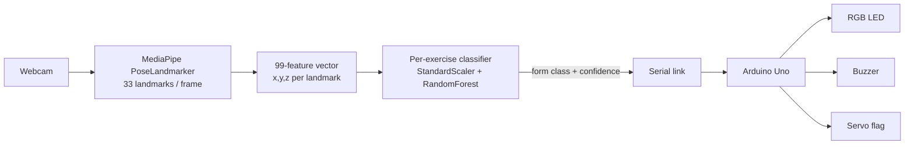

# pose-form-coach

**Real-time exercise form feedback — webcam in, physical warnings out.**

A camera watches you exercise. MediaPipe extracts your body pose, a per-exercise
classifier judges the form quality of every frame (*Up / Down / Optimal /
subOptimal / Dangerous*), and an Arduino turns the verdict into physical
feedback: a green light while your form is safe, a yellow light + warning tone
as it degrades, and a red light + alarm + servo flag when it becomes an injury
risk — all without you having to look at a screen mid-rep.

> **Demo** 🎬 — coming soon: live hardware demo GIF (LED/buzzer/servo reacting
> to good vs. dangerous squat form).

## Architecture



The classifier only actuates hardware when its confidence clears a threshold
(default 0.6) **and** the predicted class changed — no serial flooding, no
hardware chatter.

## Hardware feedback map

| Form class | RGB LED | Buzzer | Servo |
|---|---|---|---|
| Up | 🟢 green | — | 0° |
| Down | 🔵 blue | — | 0° |
| Optimal | 🟦 cyan | — | 0° |
| subOptimal | 🟡 yellow | 500 Hz warning | 135° |
| Dangerous | 🔴 red | 1000 Hz alarm | 180° |

**Wiring (Arduino Uno):** servo → pin 7, buzzer → pin 8, RGB LED → pins
10/11/12 (R/G/B, via resistors). Sketch: [`arduino/form_feedback.ino`](arduino/form_feedback.ino).

## Results

Per-exercise form-quality classifiers, evaluated on a stratified 20% hold-out
of the raw collected data (augmentation is applied to the training split only,
so these numbers are leakage-free):

| Exercise | Raw samples | Held-out test | Test accuracy |
|---|---|---|---|
| Ex1 | 521 | 105 | 100% |
| Ex2 | 643 | 129 | 100% |
| Ex3 | 614 | 123 | 100% |

> **Read these numbers honestly:** samples are pose snapshots taken from video,
> so the held-out frames come from the *same recording sessions* as the
> training frames, and adjacent frames of a held pose are nearly identical.
> That makes frame-level accuracy an **upper bound** — it demonstrates the
> classes are cleanly separable in landmark space, not that the model
> generalizes to new people or camera setups. Cross-session evaluation is on
> the roadmap.

Confusion matrices are generated into [`assets/`](assets/) by `train.py`, with
a machine-readable summary in `assets/metrics.json`.

**Approach validation:** the same landmark-classification approach scores
**≈ 89.5% test accuracy** on the public 10-class Kaggle Physical Exercise
Recognition dataset — see [`benchmark/`](benchmark/README.md).

## Quickstart

```bash
git clone https://github.com/ShawSAM37/pose-form-coach.git
cd pose-form-coach
python -m venv .venv && .venv\Scripts\activate    # Windows
pip install -r requirements.txt

# 1. Train from the committed datasets (downloads the pose model on first run)
python -m formcoach.train

# 2. Run live — software-only (no Arduino needed)
python -m formcoach.run --no-serial

# 2b. Or with the Arduino connected
python -m formcoach.run --port COM7
```

`run.py` keys: `1`–`9` switch the active exercise, `q` quits.

## Add your own exercise

```bash
# Collect labeled samples from your webcam (u/d/o/s/x label keys)
python -m formcoach.collect --out data/lunge.csv

# Retrain — every CSV in data/ becomes one exercise model
python -m formcoach.train
```

## Repo layout

```
formcoach/            the pipeline package
├── pose.py           shared MediaPipe utilities + model auto-download
├── collect.py        labeled webcam data collection
├── augment.py        jitter/scale augmentation (train-split only)
├── train.py          per-exercise training + honest evaluation
└── run.py            live inference + Arduino serial control
arduino/              feedback sketch (LED / buzzer / servo)
data/                 collected pose datasets (one CSV per exercise)
benchmark/            10-class validation on a public Kaggle dataset
assets/               confusion matrices, metrics.json, demo media
```

## Roadmap

- [ ] Hardware demo GIF
- [ ] Cross-session evaluation (train and test on separate recording sessions)
- [ ] More exercises (this semester)
- [ ] Rep counting from Up/Down transitions
- [ ] Temporal smoothing (majority vote over a sliding window)

## License

[MIT](LICENSE) — © 2026 Sameer Shaw
