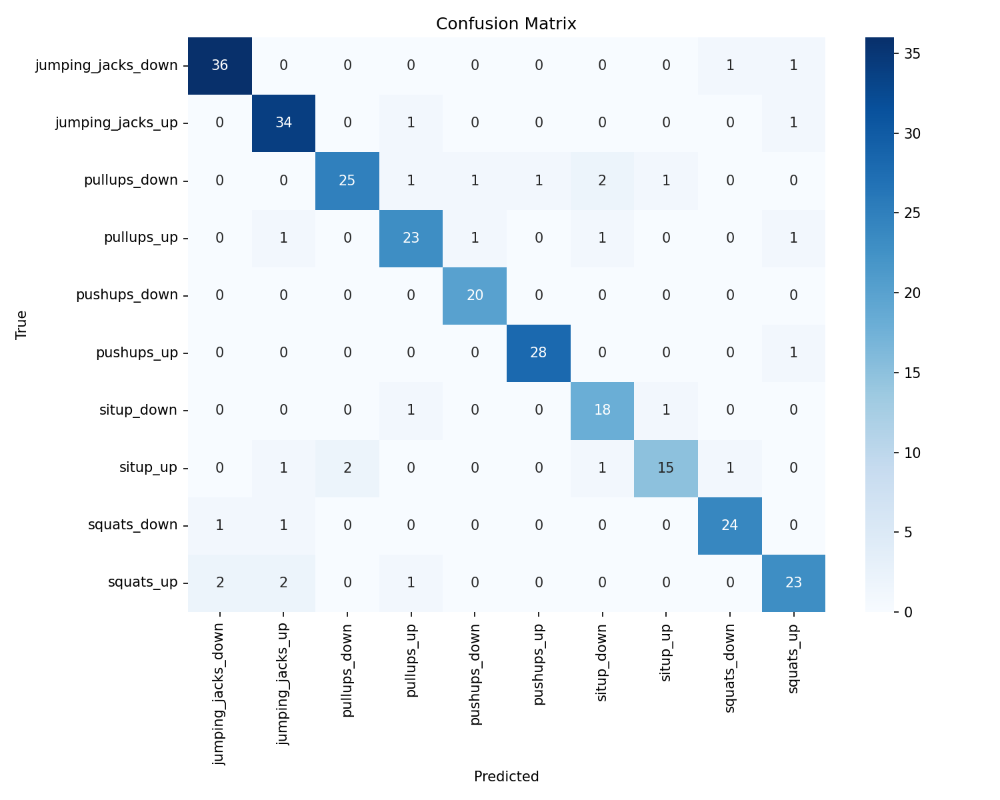

# Offline benchmark — 10-class exercise recognition

This benchmark validates the landmark-based classification approach on a
public dataset before trusting it for the live form-feedback system.

`kaggle_classifier.py` trains a 10-class exercise classifier
(jumping jacks / pull-ups / push-ups / sit-ups / squats, each split into
up/down phases) on the Kaggle **Physical Exercise Recognition** dataset
(1,371 samples of MediaPipe-derived angles, landmarks, and distances).

## Result

**≈ 89.5% test accuracy** (XGBoost, 275-sample stratified hold-out set):



Most residual confusion is between visually similar phases
(e.g. `squats_up` vs `jumping_jacks_up`).

## Reproduce

1. Download the dataset from Kaggle (search "Physical Exercise Recognition" —
   the archive containing `angles.csv`, `landmarks.csv`, `xyz_distances.csv`,
   `3d_distances.csv`, `labels.csv`).
2. Extract into `benchmark/csv_data/` (gitignored).
3. Run:

```bash
cd benchmark
python kaggle_classifier.py --csv_dir ./csv_data --model_type xgboost \
    --cm_out ../assets/confusion_matrix_kaggle.png
```

Other model types: `--model_type random_forest | svm | neural_network`.
